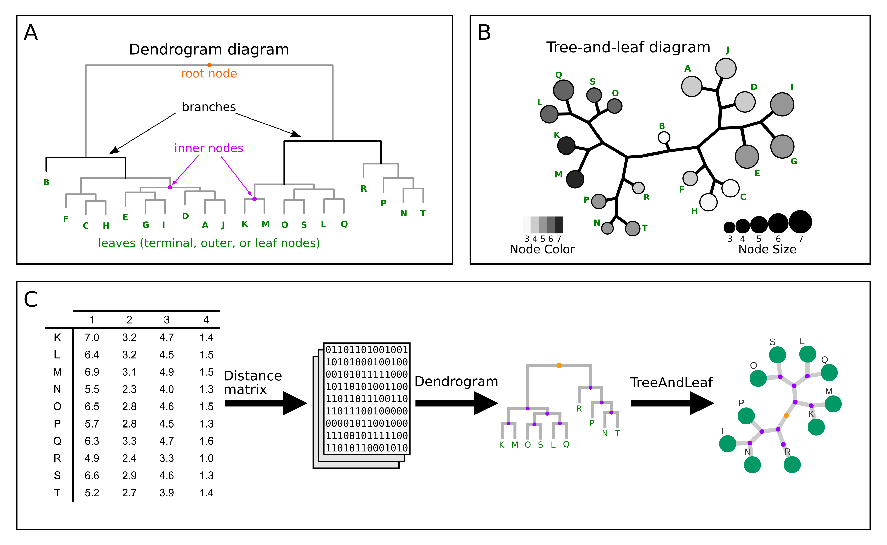
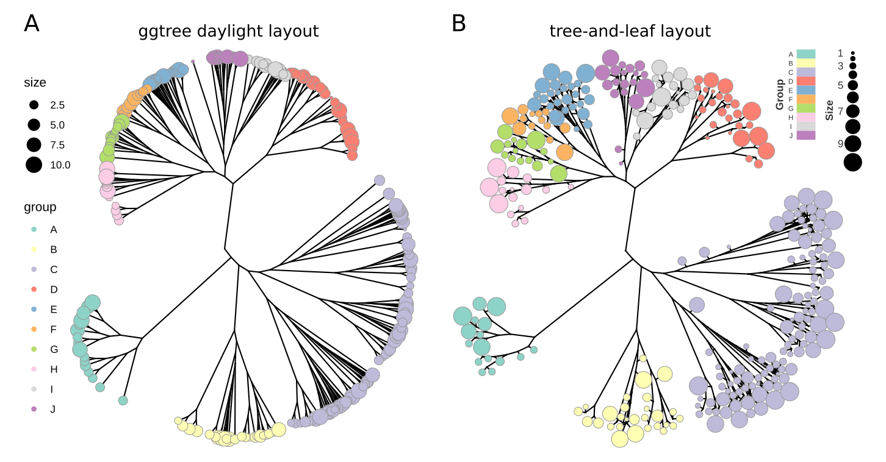

```{r, include = FALSE}
knitr::opts_chunk$set(
    collapse = TRUE,
    comment = "#>"
)
```

# Overview

A dendrogram diagram displays binary trees focused on representing 
hierarchical relations between the tree elements. A dendrogram contains 
nodes, branches (edges), a root, and leaves (**Figure 1A**). The root is where 
the branches and nodes come from, indicating the direction to the leaves, 
*i.e.*, the terminal nodes.

Most of the space of a dendrogram layout is used to arrange branches and inner 
nodes, with limited space to the leaves. For large dendrograms, the leaf 
labels are often squeezed to fit into small slots. Therefore, a dendrogram 
may not provide the best layout when the information to be displayed should 
highlight the leaves.

The **TreeAndLeaf** package aims to improve the visualization of the dendrogram 
leaves by combining tree and force-directed layout algorithms, shifting the 
focus of analysis to the leaves (**Figure 1B**). The package's workflow is 
summarized in **Figure 1C**.

<p align="center">

</p>
**Figure 1**. **TreeAndLeaf** workflow summary. **(A,B)** The dendrogram in A 
is used to construct the graph in B. **(C)** The main input for the **TreeAndLeaf** 
package consists of a dendrogram, and then the package transforms the dendrogram 
into a graph representation. The finest graph layout is achieved by a two-steps 
process, starting with an unrooted tree diagram, which is subsequently relaxed 
by a force-directed algorithm applied to the terminal nodes of the tree. The 
final *tree-and-leaf* layout varies depending on the initial state, which can be 
obtained by other tree layout algorithms (see *section 3* for examples using 
*ggtree* layouts to setup the initial state).

# Quick Start

This section provides a basic example using the R built-in `USArrests` dataset. 
The `USArrests` is a dataframe available in the user's workspace. To know more 
about this dataframe, please query `?USArrests` in the R console. We will build 
a dendrogram from the `USArrests` dataset, then transform the dendrogram into 
a *tree-and-leaf* diagram, and the result will be visualized in the **RedeR** 
application.

## Package and data requirements

```{r, eval=TRUE, message=FALSE}
#-- Libraries required in this section:
#-- TreeAndLeaf(>=1.2.1), RedeR(>=1.38.1), Bioconductor >= 3.12 (R >= 4.0)
# BiocManager::install(c("TreeAndLeaf","RedeR"))
# install.packages(c("igraph","RColorBrewer"))

#-- Load packages
library("TreeAndLeaf")
library("RedeR")
library("igraph")
library("RColorBrewer")
```

```{r, eval=TRUE, message=FALSE}
#-- Check data
dim(USArrests)
head(USArrests)
```

## Building a dendrogram example

In order to build a dendrogram from the `USArrests` dataset, we need a distance 
matrix. We will use the default "euclidean distance" method from the `dist()` 
function, and then the "average" method from `hclust()` function to create the 
dendrogram.

```{r, eval=TRUE, message=FALSE}
hc <- hclust(dist(USArrests), "ave")
plot(hc, main="Dendrogram for the 'USArrests' dataset",
     xlab="", sub="")
```

## Converting the *hclust* object into a *tree-and-leaf* object

The `treeAndLeaf` function will transform the *hclust* into an *igraph* object,
including some basic graph attributes to display in the **RedeR** application.

```{r, eval=FALSE}
#--- Get the tree-and-leaf
tal <- treeAndLeaf(hc)
```

## Setting graph attributes

The `att.mapv()` function can be used to add external annotations to an *igraph* 
object, for example, mapping new variables to the graph vertices. We will add 
all `USArrests` variables to the `tal` object. To map one object to another 
it is essential to use the same mapping IDs, set by the `refcol` parameter, 
which points to a column in the input annotation dataset. In this example, 
`refcol = 0` indicates that the `USArrests` rownames will be used as 
mapping IDs. To check the IDs in the *igraph* vertices, please type 
`V(tal)$name` in the R console.

```{r, eval=FALSE}
#--- Map attributes to the tree-and-leaf
#Note: 'refcol = 0' indicates that 'dat' rownames will be used as mapping IDs
tal <- att.mapv(g = tal, dat = USArrests, refcol = 0)
```

Now we use the `att.setv()` wrapper function to set attributes in the 
*tree-and-leaf* diagram. To see all attributes available to display in the 
**RedeR** application, please type `?addGraph` in the R console. The graph
attributes can also be customized following **igraph** syntax rules.

```{r, eval=FALSE}
#--- Set graph attributes using the 'att.setv' wrapper function
pal <- brewer.pal(9, "Reds")
tal <- att.setv(g = tal, from = "Murder", to = "nodeColor", 
                cols = pal, nquant = 5)
tal <- att.setv(g = tal, from = "UrbanPop", to = "nodeSize",
                xlim = c(10, 50, 5), nquant = 5)

#--- Set graph attributes using 'att.addv' and 'att.adde' functions
tal <- att.addv(tal, "nodeFontSize", value = 15, index = V(tal)$isLeaf)
tal <- att.adde(tal, "edgeWidth", value = 3)
```

## Plotting a *tree-and-leaf* diagram

The next steps will call the **RedeR** application, and then display the 
*tree-and-leaf* diagram in an interactive R/Java interface. The initial layout
will show an unrooted tree diagram, which will be subsequently relaxed by a 
force-directed algorithm applied to the terminal nodes of the tree.

```{r, eval=FALSE}
#--- Call RedeR application
rdp <- RedPort()
calld(rdp)
resetd(rdp)
```

```{r, eval=FALSE}
#--- Send the tree-and-leaf to the interactive R/Java interface
addGraph(obj = rdp, g = tal, zoom=75)

#--- Call 'relax' to fine-tune the leaf nodes
relax(rdp, p1=25, p2=200, p3=5, p5=5, ps=TRUE)
```

At this point, the user can interact with the layout process to achieve the 
best or desired layout; we suggest fine-tuning the force-directed algorithm 
parameters, either through the R/Java interface or the command line relaxation 
function. Note that the unroot tree diagram represents the initial state; then 
a relaxing process should start until the finest graph layout is achieved. 
The final layout varies depending on the initial state, which can also be 
adjusted by providing more or less room for the spatial configuration 
(*e.g.* via `zoom` parameter).

```{r, eval=FALSE}
#--- Add legends
addLegend.color(obj = rdp, tal, title = "Murder Rate", 
                position = "topright")
addLegend.size(obj = rdp, tal, title = "Urban Population Size",
               position = "bottomright")
```

<p align="center">

</p>

# Setting the initial *tree-and-leaf* state with *ggtree* layouts

The tree diagram represents the initial state of a *tree-and-leaf*, which is then 
relaxed by a force-directed algorithm applied to the terminal nodes. Therefore,
the final *tree-and-leaf* layout varies depending on the initial state. The
**treeAndLeaf** package also accepts `ggtree` layouts to setup the initial state. 
For example, next we show a tree diagram generated by the **ggtree** package,
and then we apply the *tree-and-leaf* transformation.

## Package and data requirements

```{r, eval=TRUE, message=FALSE}
#-- Libraries required in this section:
#-- TreeAndLeaf(>=1.2.1), RedeR(>=1.38.1), Bioconductor >= 3.12 (R >= 4.0)
# BiocManager::install(c("TreeAndLeaf","RedeR","ggtree))
# install.packages(c("igraph","ape", "dendextend", "dplyr", 
#                    "ggplot2", "RColorBrewer"))

#-- Load packages
library("TreeAndLeaf")
library("RedeR")
library("igraph")
library("ggtree")
library("ape")
library("dendextend")
library("dplyr")
library("ggplot2")
library("RColorBrewer")
```

## Building and plotting a *phylo* tree with *ggtree* layouts

```{r, eval=FALSE}
#--- Generate a random phylo tree
phylo_tree <- rcoal(300)

#--- Set groups and node sizes
group <- size <- dendextend::cutree(phylo_tree, 10)
group[] <- LETTERS[1:10][group]
size[] <- sample(size)
group.df <- data.frame(label=names(group), group=group, size=size)
phylo_tree <- dplyr::full_join(phylo_tree, group.df, by='label')

#--- Plot the phylo tree using a 'ggtree' layout
pal <- brewer.pal(10, "Set3")
ggt <- ggtree(phylo_tree, layout = 'daylight', branch.length='none')
ggt + geom_tippoint(aes(color=group, size=size)) +
  scale_color_manual(values=pal) + scale_y_reverse()
```

## Applying *tree-and-leaf* transformation to *ggtree* layouts

```{r, eval=FALSE}
#--- Get the tree-and-leaf
tal <- treeAndLeaf(ggt)

#--- Map attributes to the tree-and-leaf
#Note: 'refcol = 1' indicates that 'dat' col 1 will be used as mapping IDs
tal <- att.mapv(g = tal, dat = group.df, refcol = 1)

#--- Set graph attributes using the 'att.setv' wrapper function
tal <- att.setv(g = tal, from = "group", to = "nodeColor",
                cols = pal)
tal <- att.setv(g = tal, from = "size", to = "nodeSize",
                xlim = c(10, 50, 5))

#--- Set graph attributes using 'att.addv' and 'att.adde' functions
tal <- att.addv(tal, "nodeFontSize", value = 1)
tal <- att.addv(tal, "nodeLineWidth", value = 0)
tal <- att.addv(tal, "nodeColor", value = "black", index=!V(tal)$isLeaf)
tal <- att.adde(tal, "edgeWidth", value = 3)
tal <- att.adde(tal, "edgeColor", value = "black")
```

```{r, eval=FALSE}
#--- Call RedeR application
rdp <- RedPort()
calld(rdp)
resetd(rdp)
```

```{r, eval=FALSE}
#--- Send the tree-and-leaf to the interactive R/Java interface
addGraph(obj = rdp, g = tal, zoom=50)

#--- Select inner nodes, preventing them from relaxing
selectNodes(rdp, V(tal)$name[!V(tal)$isLeaf], anchor = TRUE)

#--- Call 'relax' to fine-tune the leaf nodes
relax(rdp, p1=25, p2=100, p3=5, p5=1, p8=5, ps=TRUE)

#--- Add legends
addLegend.color(obj = rdp, tal, title = "Group", 
                position = "topright",vertical=T)
addLegend.size(obj = rdp, tal, title = "Size", 
               position = "topleft", 
               vertical=T, dxtitle=10)
```

<p align="center">

</p>

# Case Study 1: visualizing a large dendrogram

## Context

This section follows the same steps described in the *Quick Start*, but 
using a larger dendrogram derived from the R built-in `quakes` dataset. 
The `quakes` is a dataframe available in the user's workspace. To know more 
about this dataframe, please query `?quakes` in the R console. 
We will build a dendrogram from the `quakes` dataset, then transform the 
dendrogram into a *tree-and-leaf* diagram, and the result will be visualized 
in the **RedeR** application.

## Package and data requirements

```{r, eval=TRUE, message=FALSE}
#-- Libraries required in this section:
#-- TreeAndLeaf(>=1.2.1), RedeR(>=1.38.1), Bioconductor >= 3.12 (R >= 4.0)
# BiocManager::install(c("TreeAndLeaf","RedeR"))
# install.packages(c("igraph", "RColorBrewer"))

#-- Load packages
library(TreeAndLeaf)
library(RedeR)
library(igraph)
library(RColorBrewer)
```

```{r echo=TRUE}
#-- Check data
dim(quakes)
head(quakes)
```

```{r, eval=TRUE, message=FALSE}
#-- Building a large dendrogram
hc <- hclust(dist(quakes), "ave")
plot(hc, main="Dendrogram for the 'quakes' dataset",
     xlab="", sub="")
```

## Building and plotting a large *tree-and-leaf* diagram

```{r, eval=FALSE}
#--- Get the tree-and-leaf
tal <- treeAndLeaf(hc)
```

```{r, eval=FALSE}
#--- Map attributes to the tree-and-leaf
#Note: 'refcol = 0' indicates that 'dat' rownames will be used as mapping IDs
tal <- att.mapv(tal, quakes, refcol = 0)

#--- Set graph attributes using the 'att.setv' wrapper function
pal <- brewer.pal(9, "Greens")
tal <- att.setv(g = tal, from = "mag", to = "nodeColor",
                cols = pal, nquant = 10)
tal <- att.setv(g = tal, from = "depth", to = "nodeSize",
                xlim = c(40, 120, 20), nquant = 5)

#--- Set graph attributes using 'att.addv' and 'att.adde' functions
tal <- att.addv(tal, "nodeFontSize", value = 1)
tal <- att.adde(tal, "edgeWidth", value = 10)
```

The next steps will call the **RedeR** application, and then display the 
*tree-and-leaf* diagram in an interactive R/Java interface. The initial layout
will show an unrooted tree diagram, which will be subsequently relaxed by a 
force-directed algorithm applied to the terminal nodes of the tree.

```{r, eval=FALSE}
#--- Call RedeR application
rdp <- RedPort()
calld(rdp)
resetd(rdp)
```

```{r, eval=FALSE}
#--- Send the tree-and-leaf to the interactive R/Java interface
addGraph(obj = rdp, g = tal, zoom=10)

#--- Call 'relax' to fine-tune the leaf nodes
relax(rdp, p1=25, p2=200, p3=10, p4=100, p5=10, ps=TRUE)
```

```{r, eval=FALSE}
#--- Add legends
addLegend.color(obj = rdp, tal, title = "Richter Magnitude",
                position = "bottomright")
addLegend.size(obj = rdp, tal, title = "Depth (km)")
```

<p align="center">

</p>

# Case Study 2: visualizing a phylogenetic tree

## Context

This section generates a *tree-and-leaf* diagram from a pre-computed `phylo` 
tree object. We will use a phylogenetic tree listing 121 eukaryotes, available 
from the **geneplast** package.

## Package and data requirements

```{r, eval=TRUE, message=FALSE}
#-- Libraries required in this section:
#-- TreeAndLeaf(>=1.2.1), RedeR(>=1.38.1), Bioconductor >= 3.12 (R >= 4.0)
# BiocManager::install(c("TreeAndLeaf","RedeR","geneplast))
# install.packages(c("igraph","ape", "RColorBrewer"))

#-- Load packages
library(TreeAndLeaf)
library(RedeR)
library(igraph)
library(ape)
library(geneplast)
library(RColorBrewer)
```

```{r, eval=TRUE, message=FALSE}
#-- Load data and plot the phylogenetic tree
data("spdata")
data("gpdata.gs")
plot(phyloTree)
```

## Building and plotting a *tree-and-leaf* from a phylogenetic tree

```{r, eval=FALSE}
#--- Drop organisms not listed in the 'spdata' annotation
phyloTree$tip.label <- as.character(phyloTree$tip.label)
tokeep <- phyloTree$tip.label %in% spdata$tax_id
pruned.phylo <- drop.tip(phyloTree, phyloTree$tip.label[!tokeep])
```

```{r, eval=FALSE}
#--- Get the tree-and-leaf
tal <- treeAndLeaf(pruned.phylo)

#--- Map attributes to the tree-and-leaf
#Note: 'refcol = 1' indicates that 'dat' col 1 will be used as mapping IDs
tal <- att.mapv(g = tal, dat = spdata, refcol = 1)

#--- Set graph attributes using the 'att.setv' wrapper function
pal <- brewer.pal(9, "Purples")
tal <- att.setv(g = tal, from = "genome_size_Mb",
                to = "nodeSize", xlim = c(120, 250, 1), nquant = 5)
tal <- att.setv (g = tal, from = "proteins",
                 to = "nodeColor", nquant = 5,
                 cols = pal, na.col = "black")
```

```{r, eval=FALSE}
#--- Add graph attributes using 'att.adde' and 'att.addv' functions
tal <- att.addv(tal, "nodeFontSize", value = 10)
tal <- att.adde(tal, "edgeWidth", value = 20)

# Set species names to 'nodeAlias' attribute
tal <- att.setv(tal, from = "sp_name", to = "nodeAlias")

# Select a few names to highlight in the graph
tal <- att.addv(tal, "nodeFontSize", value = 100, 
       filter=list('name'=sample(pruned.phylo$tip.label,30)))
tal <- att.addv(tal, "nodeFontSize", value = 100, 
                filter=list('name'="9606")) #Homo sapiens
```

```{r, eval=FALSE}
# Call RedeR
rdp <- RedPort()
calld(rdp)
resetd(rdp)

#--- Send the tree-and-leaf to the interactive R/Java interface
addGraph(obj = rdp, g = tal, zoom=10)

#--- Call 'relax' to fine-tune the leaf nodes
relax(rdp, p1=50, p8=15, ps=TRUE)
```

```{r, eval=FALSE}
#--- Add legends
addLegend.color(rdp, tal, title = "Proteome Size (n)")
addLegend.size(rdp, tal, title = "Genome Size (Mb)")
```

<p align="center">

</p>

# Case Study 3: visualizing a non-binary tree

## Context

The **TreeAndLeaf** package is designed to layout binary trees, but it can also
layout other graph configurations. To exemplify this case, we will use a 
larger phylogenetic tree available from the **geneplast** package, and for 
which some inner nodes have more than two children, or non-binary nodes.

## Package and data requirements

```{r, eval=FALSE}
#-- Libraries required in this section:
#-- TreeAndLeaf(>=1.2.1), RedeR(>=1.38.1), Bioconductor >= 3.12 (R >= 4.0)
# BiocManager::install(c("TreeAndLeaf","RedeR","geneplast))
# install.packages(c("igraph","ape", "RColorBrewer"))

#-- Load packages
library(TreeAndLeaf)
library(RedeR)
library(igraph)
library(ape)
library(geneplast)
library(RColorBrewer)
```

```{r, eval=TRUE, message=FALSE}
#-- Load data 
data("spdata")
data("phylo_tree")
```

```{r, eval=TRUE, message=FALSE}
#--- Drop organisms not listed in the 'spdata' annotation
tokeep <- phylo_tree$tip.label %in% spdata$tax_id
pruned.phylo <- drop.tip(phylo_tree, phylo_tree$tip.label[!tokeep])
```

## Building and plotting a *tree-and-leaf* for a non-binary tree

```{r, eval=FALSE}
#--- Get the tree-and-leaf
tal <- treeAndLeaf(pruned.phylo)
```

```{r, eval=FALSE}
#--- Map attributes to the tree-and-leaf using "%>%" operator
tal <- tal %>%
  att.mapv(dat = spdata, refcol = 1) %>%
  att.setv(from = "genome_size_Mb", to = "nodeSize",
           xlim = c(120, 250, 1), nquant = 5) %>%
  att.setv(from = "proteins", to = "nodeColor", nquant = 5,
           cols = brewer.pal(9, "Blues"), na.col = "black") %>%
  att.setv(from = "sp_name", to = "nodeAlias") %>%
  att.adde(to = "edgeWidth", value = 20) %>%
  att.addv(to = "nodeFontSize", value = 10) %>%
  att.addv(to = "nodeFontSize", value = 100,
      filter = list("name" = sample(pruned.phylo$tip.label, 30))) %>%
  att.addv(to = "nodeFontSize", value = 100, 
           filter = list("name" = "9606"))
```

```{r, eval=FALSE}
# Call RedeR
rdp <- RedPort()
calld(rdp)
resetd(rdp)

#--- Send the tree-and-leaf to the interactive R/Java interface
addGraph(obj = rdp, g = tal, zoom=5)

#--- Call 'relax' to fine-tune the leaf nodes
relax(rdp, p1=50, p8=15, ps=TRUE)
```

```{r, eval=FALSE}
#--- Add legends
addLegend.color(rdp, tal, title = "Proteome Size (n)")
addLegend.size(rdp, tal, title = "Genome size (Mb)")
```

<p align="center">

</p>


# Session information

```{r label='Session information', eval=TRUE, echo=FALSE}
sessionInfo()
```
