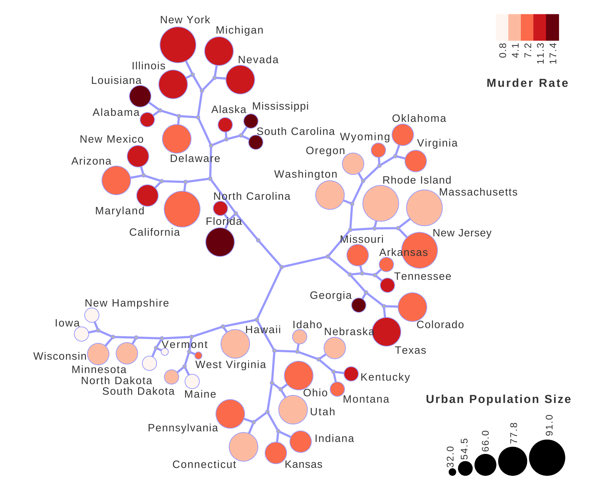
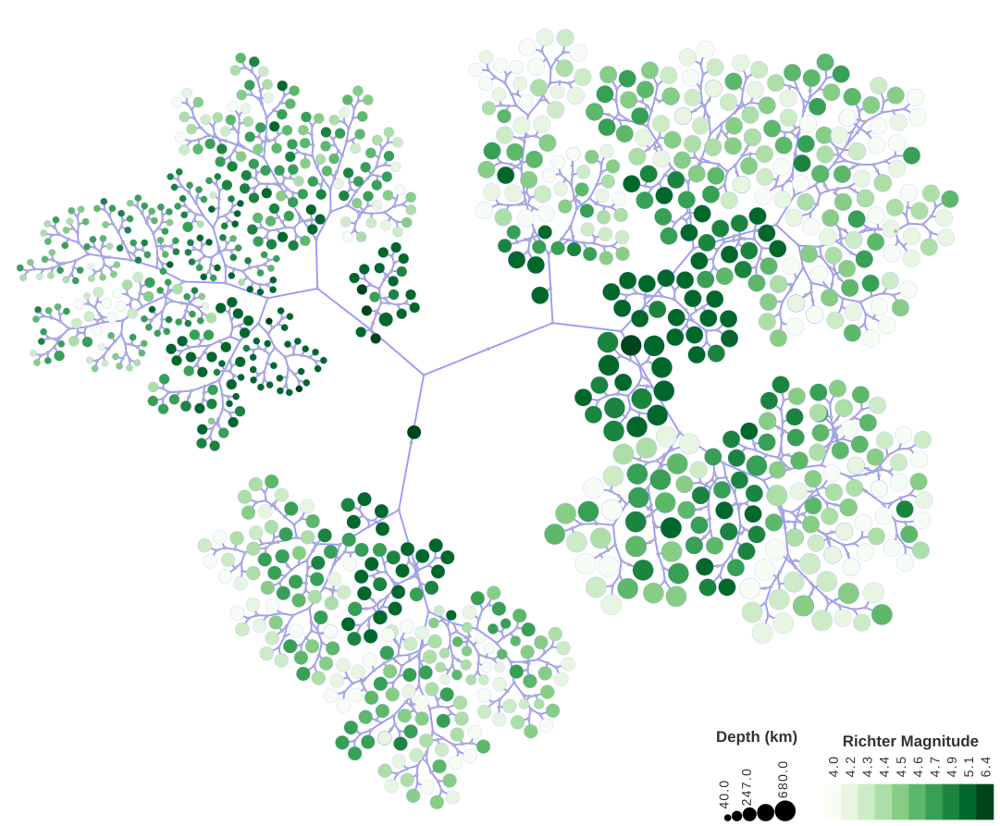
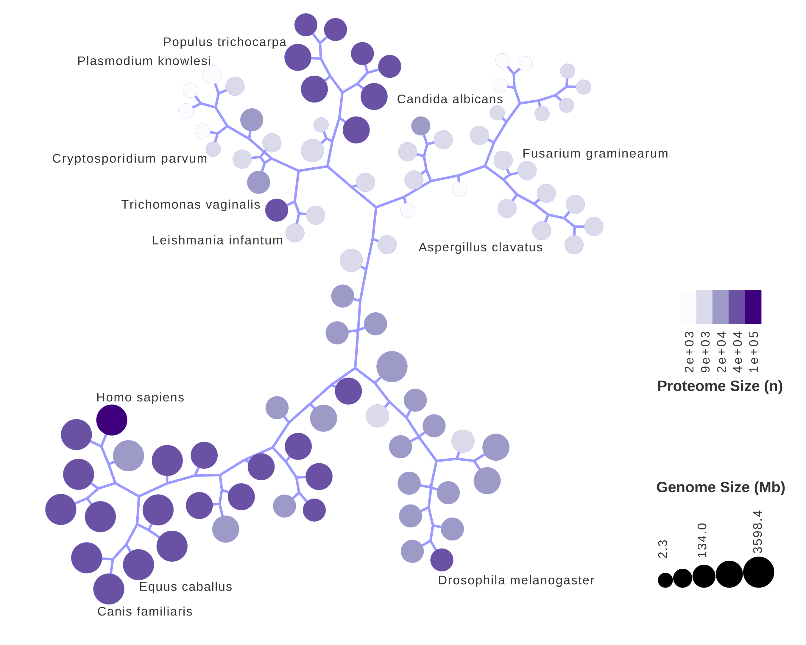
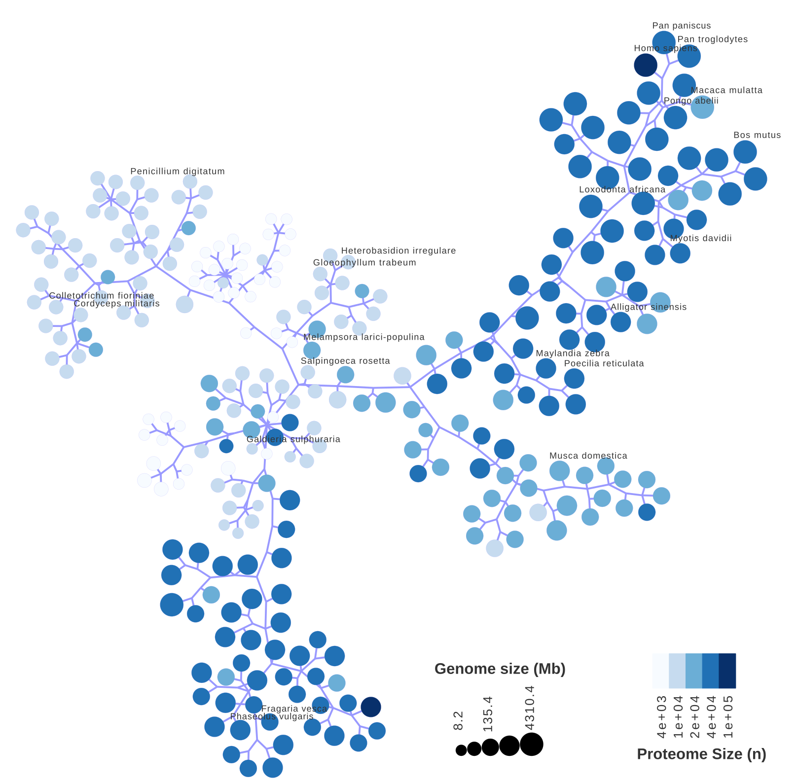

```{r, include = FALSE}
knitr::opts_chunk$set(
    collapse = TRUE,
    comment = "#>"
)
```

```{r setup}
library(TreeAndLeaf)
library(RedeR)
library(RColorBrewer)
library(igraph)
library(ape)
```

# Introduction

When working with dendrograms and phylogenetic trees, mainly the larger ones, 
plotting can get very confusing and unproductive. Problems that may arise
include lack of space in a paper for proper width, lack of options to show
related data and unappealable visual.
TreeAndLeaf package comes as an alternative to solve those problems and change
the approach to dendrograms plotting of any kind. It treats a whole dendrogram
as a tree, in which the observations are represented by the leaves. The
advantages of using this packages are:

  *  The tree format enhances space distribution because it uses all
  directions, allowing better positioning of an image in an article.
  *  RedeR, used for plotting in this package, uses a force-based relaxation
  algorithm that gives enough repel for nodes to avoid overlaps and makes the
  tree look appealable.
  *  By working with igraphs and RedeR, you can easily customize your 
  dendrogram inserting multiple layers of information to be represented by 
  edge widths and colors, nodes colors, sizes, line color, etc.
  *  The package also includes a fast formatting option for quick and
  exploratory analysis usage.

This document intends to guide you through the basics and give you ideas of how
to use the functions to their full potential. Although TreeAndLeaf was created
for systems biology application, we will show you that it is not at all limited
to this use.

# USArrests - a small dendrogram example

To show a quick and basic way to use TreeAndLeaf package, we will use the R
built-in dataframe `USArrests`, shown below. To know more about the info shown
in this dataframe, use `?USArrests`. To use TreeAndLeaf functions to their full
potential, we recommend that your dataframe has rownames set before making the
dendrogram, just like this one. 

```{r echo=TRUE}
dim(USArrests)
head(USArrests)
```

This vignette will guide you through the steps of making a tree from this data.

## Building a dendrogram using R `hclust()`

In order to build a dendrogram, you need to have a distance matrix of the
observations. In this example, we will use the default "euclidean distance"
method of `dist()` to generate one, and then use the "average" method of
`hclust()` to create a dendrogram. 

```{r echo=TRUE}
hc <- hclust(dist(USArrests), "ave")
plot(hc)
```

## Converting your hclust object to an igraph object

This is a rather simple but important step. Since TreeAndLeaf and RedeR work
with igraph objects, we provide a function to convert an hclust dendrogram into
an igraph. To do that, simply follow use `hclust2igraph()`.

```{r}
gg <- hclust2igraph(hc)
```

## Formating the igraph for better visualization in RedeR

To achieve the desired looks of a tree and its leaves, there is a quick 
formatting option in TreeAndLeaf package by using the function `formatTree()`.
This is a theme function used to standardize node sizes and colors. This is an
important step because the tree will have leaf nodes (the ones the represent
your observations) and non-leaf nodes (the ones representing bifurcations of
the dendrogram), and this function makes the last ones invisible to achieve
the desired looks and proper relaxation.
For a description of available themes, try `?formatTree`.

```{r}
gg <- formatTree(gg = gg, theme = 5)
```

If you don't intend to add more layers of information to your tree-and-leaf 
diagram, it is ready to be shown in RedeR with `treeAndLeaf()`. Now, if you 
want more info on your graph, you should follow the next steps.

## Inserting additional layers of information

RedeR offers a set of functions to manipulate igraph attributes according to 
the parameters the application reads.
For the first step, you should use `att.mapv()` to insert the dataframe inside
the igraph object and make it available for setting node attributes. In this 
step, it is crucial that the `refcol` points to a column with the same content
as `hc$labels`. In this case, we use `refcol = 0` to indicate the rownames of 
the dataframe.

```{r}
gg <- att.mapv(g = gg, dat = USArrests, refcol = 0)
```

Now that the info is available, we use the `att.setv()` to change the igraph
attributes. We will use the RColorBrewer package to generate a palette for
reference. If you want to see the options of igraph attributes RedeR can read,
try `?addGraph`.

```{r}
pal <- brewer.pal(9, "Reds")
gg <- att.setv(g = gg, from = "Murder", to = "nodeColor",
                        cols = pal, nquant = 5)
gg <- att.setv(g = gg, from = "UrbanPop", to = "nodeSize",
                        xlim = c(50, 150, 1), nquant = 5)
```

## Calling the RedeR interface

With the igraph ready to be visualized, we need to bring up RedeR interface.
This might take some seconds.
```{r, eval = FALSE}
rdp <- RedPort()
calld(rdp)
resetd(rdp)
```

## Calling `treeAndLeaf()` and adding legends

This is the package main function. It will read your igraph object, generate
the tree layout, plot it in RedeR interface and use functions to enhance
appealability and distribution. 

```{r, eval = FALSE}
treeAndLeaf(obj = rdp,
            gg = gg)
```

Adding legends is optional. When you use `att.setv()` and inform column names
for nodeColor and nodeSize, it will automatically generate a RedeR readable
legend, which you can plot using the code below.


```{r, eval = FALSE}
addLegend.color(obj = rdp,
                        gg,
                        title = "Murder Rate",
                        position = "right")

addLegend.size(obj = rdp,
                        gg,
                        title = "Urban Population Size",
                        position = "bottomright")
```

## Making manual adjustments
At this stage the image produced needs small ajustments to solve the residual
edge crossings.
You can just click and drag a node to ajust it while the relaxation algorithm
is still running.

<p align="center">

</p>

Feel free to toy around with different parameters throughout the steps to
achieve your desired image.

# A large dendrogram example - quakes

It is when we use large dendrograms that we see TreeAndLeaf shine. In this
example, we will use the `quakes` built-in dataframe. To know more about this
data, check `?quakes`. Since each step was detailed in the first example, we
will focus on describing only features we were not able to see with `USArrests`.

```{r echo=TRUE}
dim(quakes)
head(quakes)
```

## Building the dendrogram

As we are able to see, when it comes to big dendrograms, it gets harder to
show clusterization and any other information by conventional plotting.
This is where TreeAndLeaf really makes a difference.

```{r echo=TRUE}
hc <- hclust(dist(quakes))
plot(hc)
```

## Converting and formating the igraph object

As described before, we use the package functions `hclust2igraph()` for
converting, `formatTree()` for initial attribute setting, `att.mapv()` for
inserting the dataframe inside the igraph object and `att.setv()` to change
graph characteristics. 

```{r}
gg <- hclust2igraph(hc)
gg <- formatTree(gg, theme = 1, cleanalias = TRUE)
gg <- att.mapv(gg, quakes, refcol = 0)

pal <- brewer.pal(9, "Greens")
gg <- att.setv(gg, from = "mag", to = "nodeColor",
                        cols = pal, nquant = 10)

gg <- att.setv(gg, from = "depth", to = "nodeSize",
                        xlim = c(240, 880, 1), nquant = 5)

```

If you look closely, on the first example the nodeSize ranged from 50 to 150
and on this one, it ranged from 240 to 880. The `treeAndLeaf()` function uses
less zoom to plot if the dendrogram has a great number of nodes, so it is
necessary to use bigger sizes for bigger trees.
Like said before, RedeR uses a relaxation force-based algorithm to achieve a
stable distribution of node. One of the parameters used to calculate attraction
and repulsion forces is the nodeSize. Therefore, this is a vital attribute for
TreeAndLeaf structure formation. If sizes are too small, the nodes will barely
move during the relaxation process. If sizes are too big, overlaps will be
difficult to solve and weird behaviors can arise. If the sizes are too different
(i.e. 10 and 1000), you probably won't be able to see the smaller ones.
That being said, if your tree is acting weird, try to toy around with node sizes
to achieve the desired goal.

## Calling RedeR interface and plotting

This step is exactly the same as the first example.
```{r, eval = FALSE}
rdp <- RedPort()
calld(rdp)
resetd(rdp)
```

```{r, eval = FALSE}
treeAndLeaf(rdp, gg)
addLegend.color(obj = rdp,
                        gg,
                        title = "Richter Magnitude")
addLegend.size(obj = rdp,
                        gg,
                        title = "Depth (km)")
```

## Making manual adjustments

After manually solving some overlaps, you should be able to achieve the result
shown below.

<p align="center">

</p>

# Phylogenetic tree

The TreeAndLeaf package is also able to work with phylogenetic trees. To show
how it works, we will apply these steps to plot a tree from geneplast package.
It is a tree with 121 tips listing the eukaryotes in STRING-db, release 9.1.

## Loading data

As mentioned, the tree can be loaded from geneplast package by running the code
below.

```{r}
library(geneplast)
data("gpdata.gs")
plot(phyloTree)
```

Aside from exhibiting the phylogenetic tree as a tree-and-leaf diagram, we also
want to add extra layers of data to each species. TreeAndLeaf package offers a
dataframe containing statistical data of eukaryotes complete genomes, scraped
from NCBI Genomes database. For more info, try `?spdata`.

```{r}
data("spdata")
```

## Matching data from both sources

The `spdata` object only shows data for eukaryotes with complete genomes
available, so we need to make an inner join to select only the species available
in both datasets used. We will, therefore, check which tips of the `phylo`
object have a match with a row in `spdata`. Then, we will remake the tree only
with the selected tips.

```{r}
#Accessory indexing
idx <- match(as.numeric(spdata$tax_id), as.numeric(phyloTree$tip.label))
idx <- idx[!is.na(idx)]
tokeep <- phyloTree$tip.label[idx]
phyloTree$tip.label <- as.character(phyloTree$tip.label)

#Remaking the tree
pruned.tree <- 
    drop.tip(phyloTree,phyloTree$tip.label[-match(tokeep,
                                                        phyloTree$tip.label)])
```


## Converting the phylo object to igraph

For converting a phylogenetic tree to an igraph, the package provides a
different function: `phylo2igraph()`.
```{r}
tal.phylo <- phylo2igraph(pruned.tree)
```

## Formatting and adding extra layers of information

The following steps are the same as described before, so we will skip
explanations.
```{r}
#Formatting of the graph
tal.phylo <- formatTree(tal.phylo, theme = 4)

tal.phylo <- att.mapv(g = tal.phylo, dat = spdata, refcol = 1)

tal.phylo <- att.setv(g = tal.phylo, from = "genome_size_Mb",
                                to = "nodeSize", 
                                xlim = c(120, 250, 1), nquant = 5)

pal <- brewer.pal(9, "Purples")
tal.phylo <- att.setv (g = tal.phylo, from = "proteins",
                                to = "nodeColor",
                                nquant = 5, cols = pal, na.col = "black")
```

## Selecting names to be shown when plotting

If we use `treeAndLeaf()` now the NCBI TaxIDs will be shown above each node,
and this is not very appealing. So we will modify our igraph to show species
names, but not all of them, to prevent unreadability. For that, we will use
general igraph manipulation functions.

```{r}
#Changing the alias to show the names and making them invisible
idx <- match(V(tal.phylo)$nodeAlias, spdata$tax_id)
V(tal.phylo)$nodeAlias <- spdata$sp_name[idx]
V(tal.phylo)$nodeAlias[is.na(V(tal.phylo)$nodeAlias)] <- ""
V(tal.phylo)$nodeFontSize <- 1

#Randomly selecting some names to be shown
set.seed(9)
V(tal.phylo)$nodeFontSize[sample(
    1:length(V(tal.phylo)$nodeFontSize), 50)] <- 100
V(tal.phylo)$nodeFontSize[V(
    tal.phylo)$name == "9606"] <- 100 #Homo sapiens
```

## Plotting and making manual adjustments

```{r eval = FALSE}
#Calling RedeR and plotting
rdp <- RedPort()
calld(rdp)
resetd(rdp)

treeAndLeaf(rdp, tal.phylo)
addLegend.size(rdp, tal.phylo, title = "Genome Size (Mb)")
addLegend.color(rdp, tal.phylo, title = "Protein Count")
```

<p align="center">

</p>

# Nonbinary species Tree from STRING-db v11.0

Although TreeAndLeaf was written to work with binary trees, it also works for
some nonbinary diagrams such as the STRING-db species tree, release v11.0. Since
all features were detailed on previous example, this is just a demonstration and
there will be no code explanation other than comments. This example uses the
same NCBI Genomes scraped dataframe, applied on the previous example.

```{r}
#Loading data
data("spdata") #NCBI Genomes scraped info
data("phylo_species") #STRING-db tree metadata
data("phylo_tree") #STRING-db phylo object

#Remaking the tree with species inside spdata
idx <- match(as.numeric(spdata$tax_id), as.numeric(phylo_species$X...taxon_id))
idx <- idx[!is.na(idx)]
tokeep <- phylo_species$X...taxon_id[idx]
pruned.tree <- 
    drop.tip(phylo_tree,phylo_tree$tip.label[-match(tokeep,
                                                        phylo_tree$tip.label)])

#Converting phylo to igraph
tal.phy <- phylo2igraph(pruned.tree)

#Formatting the tree
tal.phy <- formatTree(gg = tal.phy, theme = 3)

tal.phy <- att.mapv(g = tal.phy, dat = spdata, refcol = 1)

tal.phy <- att.setv(g = tal.phy, from = "genome_size_Mb",
                            to = "nodeSize",
                            nquant = 5, xlim = c(200, 600, 1))

pal <- brewer.pal(9, "Blues")
tal.phy <- att.setv(g = tal.phy, from = "proteins", to = "nodeColor", 
                            nquant = 5, cols = pal, na.col = "black")

#Randomly selecting names to be shown
set.seed(9)
V(tal.phy)$nodeFontSize <- 1
V(tal.phy)$nodeFontSize[sample(
    1:length(V(tal.phy)$nodeFontSize), 80)] <- 300
V(tal.phy)$nodeFontSize[V(tal.phy)$name == 9606] <- 300

idx <- match(V(tal.phy)$nodeAlias, spdata$tax_id)
V(tal.phy)$nodeAlias <- spdata$sp_name[idx]
V(tal.phy)$nodeAlias[is.na(V(tal.phy)$nodeAlias)] <- ""

```

```{r eval = FALSE}
#Calling RedeR and plotting
rdp <- RedPort()
calld(rdp)
resetd(rdp)

treeAndLeaf(rdp, tal.phy)
addLegend.color(rdp, tal.phy)
addLegend.size(rdp, tal.phy)
```

<p align="center">

</p>


# Installation

The package can be installed directly from its GitHub repository.

```{r eval=FALSE}
if (! requireNamespace("devtools", quietly = TRUE))
install.packages("devtools")
devtools::install_github("sysbiolab/TreeAndLeaf", force = TRUE)
```

# Session information

```{r label='Session information', eval=TRUE, echo=FALSE}
sessionInfo()
```
